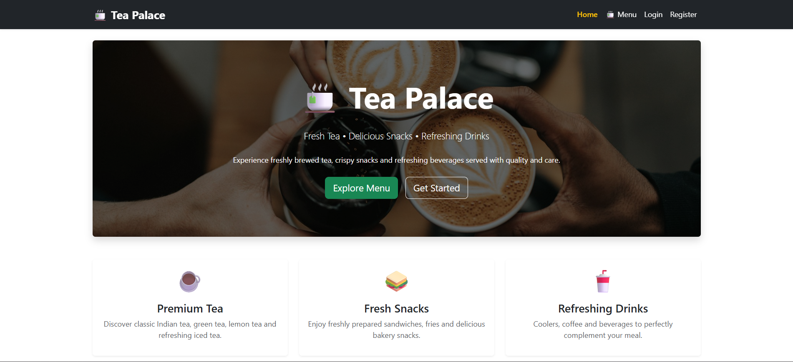
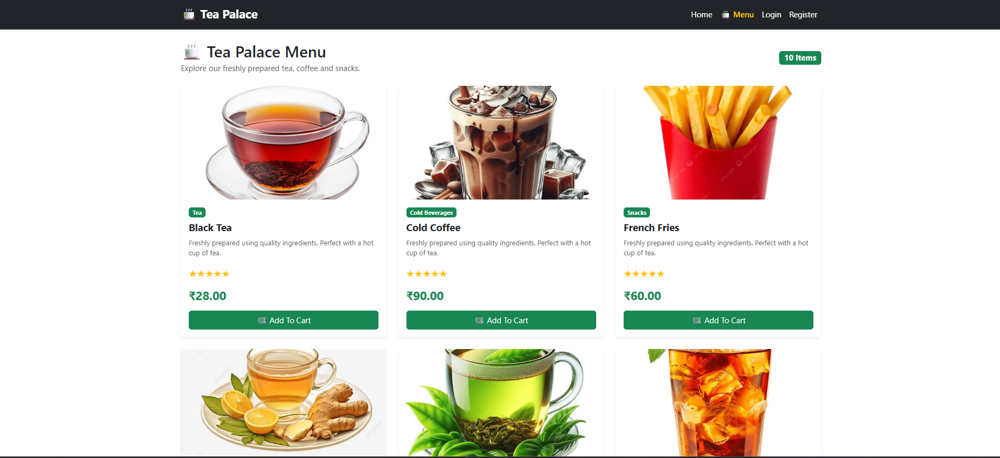
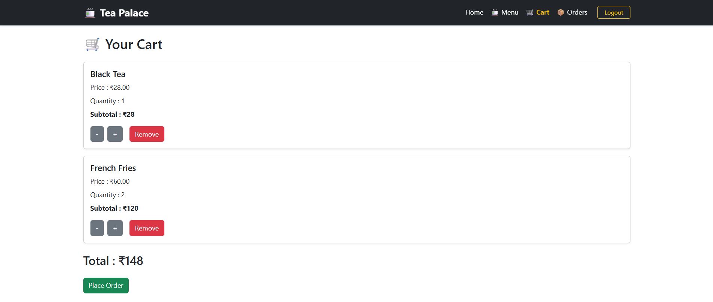
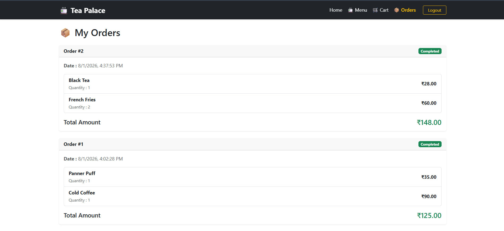
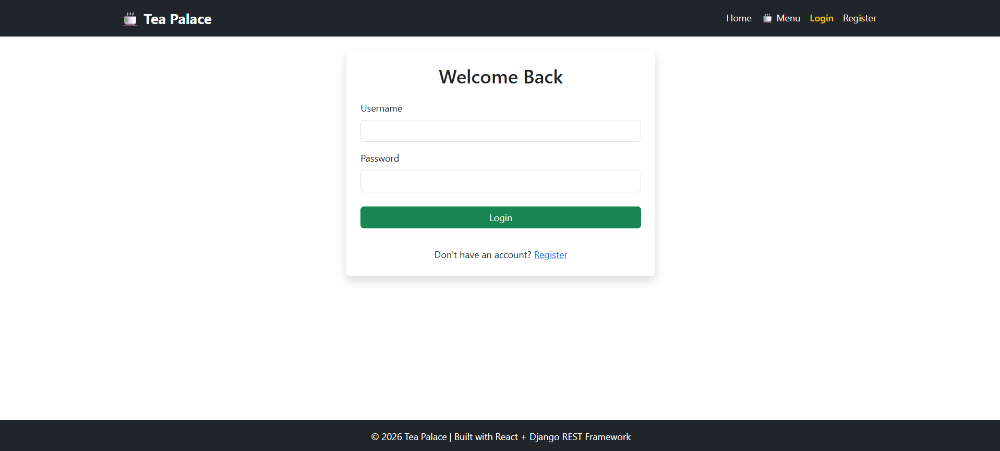
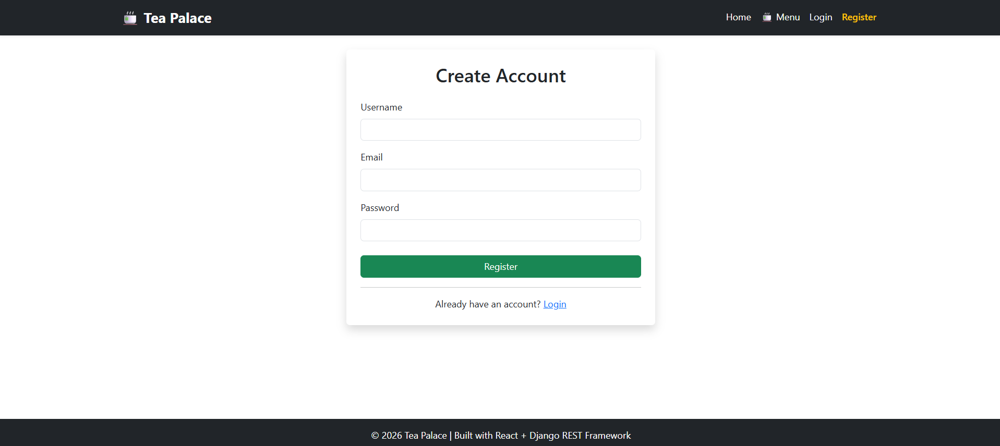

# 🍵 Tea Palace

A simple full-stack Tea Shop web application built using **React**, **Django REST Framework**, and **PostgreSQL**.

Tea Palace allows users to browse tea and snack items, register/login using JWT authentication, add products to a shopping cart, and place orders.

> This project was built as a portfolio project to demonstrate full-stack development skills using React and Django.

---

# 📸 Screenshots

| Home | Products |
|------|----------|
|  |  |

| Cart | Orders |
|------|---------|
|  |  |

| Login | Register |
|------|-----------|
|  |  |

---

# ✨ Features

- User Registration
- User Login (JWT Authentication)
- Browse Tea & Snacks
- Product Categories
- Add Products to Cart
- Update Cart Quantity
- Remove Products from Cart
- Place Orders
- View Order History
- Responsive Bootstrap UI

---

# 🛠 Tech Stack

## Frontend

- React
- React Router
- Axios
- Bootstrap 5

## Backend

- Django
- Django REST Framework
- Simple JWT

## Database

- PostgreSQL

---

# 📁 Project Structure

```
Tea-Palace
│
├── backend
│   ├── accounts
│   ├── products
│   ├── cart
│   ├── orders
│   └── config
│
├── frontend
│   ├── src
│   ├── public
│   └── package.json
│
├── screenshots
│
└── README.md
```

---

# 🚀 Installation

## Clone Repository

```bash
git clone https://github.com/YOUR_USERNAME/tea-palace.git

cd tea-palace
```

---

# Backend Setup

Create Virtual Environment

```bash
python -m venv venv
```

Activate

Windows

```bash
venv\Scripts\activate
```

Install Dependencies

```bash
pip install -r requirements.txt
```

Create `.env`

```env
SECRET_KEY=your-secret-key

DEBUG=True

DB_NAME=tea-palace

DB_USER=postgres

DB_PASSWORD=your-password

DB_HOST=localhost

DB_PORT=5432
```

Run Migrations

```bash
python manage.py migrate
```

Create Superuser

```bash
python manage.py createsuperuser
```

Run Server

```bash
python manage.py runserver
```

---

# Frontend Setup

Move to frontend

```bash
cd frontend
```

Install Packages

```bash
npm install
```

Start React

```bash
npm run dev
```

---

# API Endpoints

## Authentication

| Method | Endpoint |
|---------|----------|
| POST | /api/auth/register/ |
| POST | /api/auth/login/ |
| GET | /api/auth/profile/ |

---

## Products

| Method | Endpoint |
|---------|----------|
| GET | /api/products/ |
| POST | /api/products/ |
| PUT | /api/products/{id}/ |
| DELETE | /api/products/{id}/ |

---

## Cart

| Method | Endpoint |
|---------|----------|
| GET | /api/cart/ |
| POST | /api/cart/add/ |
| PATCH | /api/cart/items/{id}/ |
| DELETE | /api/cart/items/{id}/delete/ |

---

## Orders

| Method | Endpoint |
|---------|----------|
| POST | /api/orders/place/ |
| GET | /api/orders/ |

---

# Future Improvements

- Product Search
- Product Filtering
- User Profile
- Order Status Tracking
- Payment Integration
- Product Reviews

---

# What I Learned

While building this project I practiced:

- Django REST Framework
- JWT Authentication
- React Routing
- REST API Integration
- Axios
- PostgreSQL
- CRUD Operations
- Bootstrap UI Development
- Frontend & Backend Integration

---

# Author

**Mohamed Azarudeen S**

GitHub: https://github.com/Azar-02

LinkedIn: https://www.linkedin.com/in/azarudeen-md/
